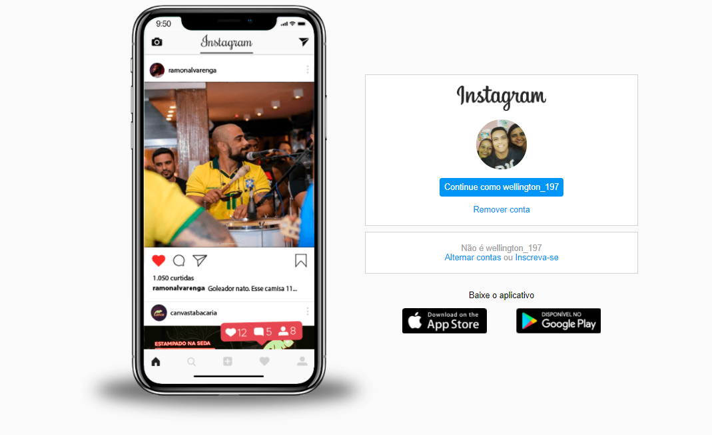

<h1 align="center"> Pagina Inicial do Instagram </h1>

 Nesse projeto foi reconstruida a página inicial de login do Instagram, no qual foi abordado o conceito sobre HTM5 e CSS3 utilizando Flexbox, uma metodologia de posicionamento de elementos em tela mais utilizada no mercado assim como conceitos de responsividade.

 
 

### Imagens do projeto

<h3>Imagen inicial</h3>
 

<h3>Imagen com responsividade max-width: 1024px</h3>
 

<h3>Imagen com responsividade max-width: 650px</h3>
 

### Conceitos aplicados no projeto
- Criação de página do instagram ultilizando conceitos em Flexbox
    - Aplicando conceito de HTML5 e CSS3 
    - Subindo para GitHub

### Atividades realizadas 

- [X] Criação da página inicial
- [X] Estilização via CSS3
- [X] Aplicação de posicionamento dos elementos
- [X] Criação de repositório no GitHub
- [X] Criação e edição do Readme
- [X] Finalização do projeto

## O que a plataforma é capaz de fazer :checkered_flag:

:trophy: Plataforma criada com conceito de responsividade. 
:trophy: Criação e adição de repositório no GitHub 
:trophy: Criação e edição do Readme 

## Como está andamento do projeto.

> Status do Projeto: Concluido :heavy_check_mark: 
> Status do Projeto: Em desenvolvimento :warning:

## Linguagens e libs utilizadas :books:
    * LINGUAGENS
        - HTML5
        - CSS3

    * METODOLOGIA
        - Flexbox
        - RESPONSIVIDADE

    * FERRAMENTAS
        - GitHub
        - Visual Stúdio

## Mentoria e Colaboração:

[<h5>Mentoria</h5>     Gabriela Pinheiro ](https://github.com/SpruceGabriela) |[<h5>Dev</h5>     Francisco Wellington Costa ](https://github.com/wellington197) |[<h5>Plataforma</h5>     Digital Innovation One ](https://github.com/search?q=digitalinovation) 
| :---: | :---: | :---: |